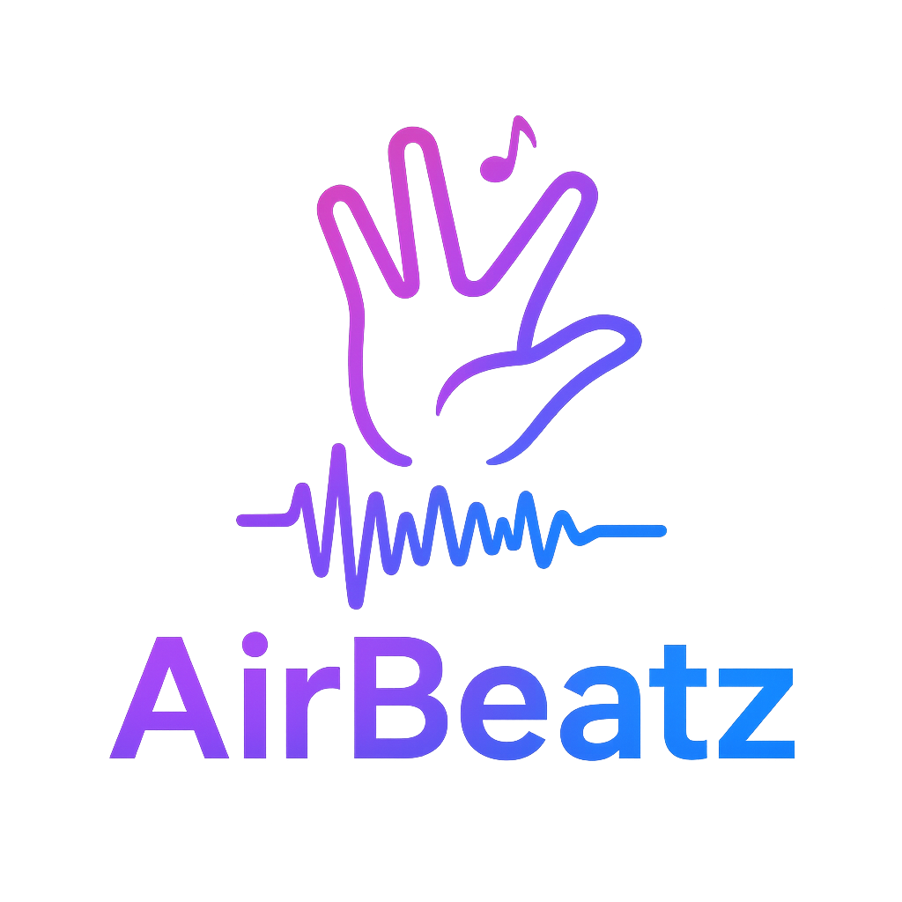

<p align="center">
  
</p>


_A computer vision–powered Virtual DJ controller_  
Turn your webcam into a virtual DJ deck! **AirBeatz** lets you control volume, speed, pitch, and track navigation using intuitive hand gestures in real time.

---

## ✨ Features

- **🎛 Intuitive Gesture Controls** – Manipulate volume, speed, and pitch using natural hand movements.  
- **⚡ Real-time Audio Processing** – Hear changes instantly as you move your hands.  
- **👁️ Visual Feedback** – On-screen visualization of audio parameters and waveforms.  
- **🎵 Track Navigation** – Switch between tracks using hand twist gestures.  


---

## ⚙️ How It Works

AirBeatz uses your webcam with **MediaPipe Hand Landmark Detection** to recognize hand gestures. Different gestures control various audio aspects:

| Control | Gesture | Effect |
|---------|---------|--------|
| **Volume** | Distance between hands | 0.0 – 1.0 gain |
| **Speed** | Left hand pinch (thumb + index) | 0.5× – 1.5× playback speed |
| **Pitch** | Right hand pinch (thumb + index) | Adjusts pitch without affecting tempo |
| **Next Track** | Right hand twist | Moves to next track |
| **Previous Track** | Left hand twist | Returns to previous track |
| **Reset** | `R` key | Returns all parameters to default |

---

## 📦 Requirements

- **Python 3.11.x** (recommended) – Python 3.10 also works.  
  > ⚠️ Python 3.12+ or 3.13 may cause MediaPipe installation issues.  
- Webcam  
- Audio files in **WAV** format  

---

## 🚀 Installation

### 1. Install Python 3.11
Download [Python 3.11.x](https://www.python.org/downloads/).  

**Windows:**
- Check "Install for all users"  
- Enable "py launcher"  
- (Optional) Skip adding to PATH  

**Verify installation:**
```bash
# Windows
py -3.11 --version

# macOS / Linux
python3.11 --version


Expected output:

```
Python 3.11.x
```

---

### 2. Clone the repository

```bash
git clone https://github.com/akshit40/AirBeatz.git
cd AirBeatz
```

---

### 3. Create a Python 3.11 virtual environment

**Windows (PowerShell):**

```bash
py -3.11 -m venv .venv311
.\.venv311\Scripts\Activate.ps1
```

**Windows (Git Bash):**

```bash
py -3.11 -m venv .venv311
source .venv311/Scripts/activate
```

**macOS / Linux:**

```bash
python3.11 -m venv .venv311
source .venv311/bin/activate
```

**Confirm:**

```bash
python --version
# Should display Python 3.11.x
```

If you previously created a venv with another version, remove it first:

```bash
# PowerShell
Remove-Item -Recurse -Force .\venv

# Bash
rm -rf venv .venv .venv311
```

---

### 4. Install dependencies

```bash
python -m pip install --upgrade pip
pip install -r requirements.txt
```

---

### 5. Prepare directories for audio assets

```bash
mkdir -p songs sounds
```

**Windows (PowerShell equivalent):**

```bash
New-Item -ItemType Directory -Force -Path songs,sounds | Out-Null
```

Add your `.wav` music files to `songs/` and optional sound effects to `sounds/`.

---

### 6. Verify MediaPipe availability (Optional)

```bash
# PowerShell
pip index versions mediapipe | findstr 0.10.21

# Bash
pip index versions mediapipe | grep 0.10.21
```

If no versions appear, ensure you are using Python 3.10 or 3.11.

---

## ▶️ Usage

Run the main application:

```bash
python src/dj_pyo.py
```

Position yourself in front of the webcam. Use the gestures to control audio:

* **Volume**: Move hands closer/further apart
* **Speed**: Pinch left hand
* **Pitch**: Pinch right hand
* **Previous Track**: Twist left hand
* **Next Track**: Twist right hand
* **Quit**: Press `Q`
* **Reset parameters**: Press `R`

---

## 🛠 Troubleshooting

* **No camera detected:** Ensure webcam is connected and free.
* **No hands detected:** Adjust lighting and hand position.
* **Audio doesn’t play:** Check `.wav` file format and location.
* **MediaPipe installation fails:** Use Python 3.11 virtual environment.
* **Activation script not found in Git Bash:** Use `source .venv311/Scripts/activate`
* **Multiple Python versions:** Run with `py -3.11` explicitly

---

## 📂 Project Structure

```
AirBeatz/
├── src/
│   ├── dj_pyo.py       # Main application
│   └── Trials/         # Experimental features
├── songs/              # Music tracks
├── sounds/             # Sound effects
├── requirements.txt
└── README.md
```

---

## 🤝 Acknowledgments

* [MediaPipe](https://developers.google.com/mediapipe) – Hand tracking
* [Pyo](https://ajaxsoundstudio.com/software/pyo/) – Audio processing
* [OpenCV](https://opencv.org/) – Webcam input and visualization

---

## 📜 License

This project is licensed under the **MIT License** – see the [LICENSE](LICENSE) file for details.

---

## 🌟 Contributing

Contributions are welcome!

1. Fork the repository
2. Create a feature branch (`git checkout -b feature-name`)
3. Commit your changes
4. Open a Pull Request

---

## 💡 Future Ideas

* Gesture-based sound effect triggers
* Multi-hand DJ support
* Advanced visualizations and GUI

> 🚀 With **AirBeatz**, your hands are the DJ — no hardware required!
